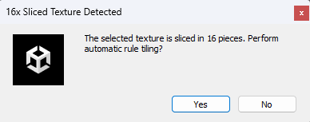

# Cheatsheet

If these instructions are too vague, refer to a more detailed explanation in the [user guide](user-guide.md).

## Import a compatible tilesheet

### Steps:

#### 1. Import the tilesheet into Unity

Dual Grid supports standard 16x dual grid tilesheets. They look like this:

#### 2. Slice the tilesheet

Select the sprite in the Project Explorer and set 'Sprite Mode' to _Multiple_.

Open the Sprite Editor, and slice it with the following configuration:

Apply and save changes.

## Create a Dual Grid Rule Tile

### Requirements:

- A [prepared 16x tilesheet](#import-a-compatible-tilesheet);

### Steps:

#### 1. Automatically create the Dual Grid Rule Tile

Right-click in the prepared tilesheet texture and click Create -> 2D -> Tiles -> Dual Grid Rule Tile.

A dialog window will popup:

Click yes.

## Create a working Dual Grid Tilemap

### Requirements:

- A [functional dual grid rule tile](#create-a-dual-grid-rule-tile);

### Steps:

#### 1. Create the Dual Grid Tilemap

Click on GameObject -> 2D Object -> Tilemap -> Dual Grid Tilemap.

#### 2. Assign the Dual Grid Rule Tile to the Tilemap

Go to the newly created Grid -> Data Tilemap. In the Dual Grid Tilemap Module, drag and drog a Dual Grid Rule Tile.

## Set Colliders in a Dual Grid Tilemap

### Requirements:

- A functional [Dual Grid Tilemap Module](#create-a-working-dual-grid-tilemap);

### Steps:

#### 1. Set the collider type in the Dual Grid Rule Tile

Go to the respective Dual Grid Rule Tile.

Set the collider to the desired type:

#### 2. Enable Tilemap Colliders in the Dual Grid Tilemap Module

Go to the created Dual Grid Tilemap Module.

Enable the Tilemap Colliders:

## Set Data Tilemap GameObjects in a Dual Grid Tilemap

### Requirements:

- A functional [Dual Grid Tilemap Module](#create-a-working-dual-grid-tilemap);

### Steps:

#### 1. Set the GameObject in the Dual Grid Rule Tile

Go to the respective Dual Grid Rule Tile.

Set the GameObject in Rule Tile Settings:

#### 2. Set the Game Object Origin to Data Tilemap in the Dual Grid Tilemap Module

Go to the created Dual Grid Tilemap Module.

Set the field 'Game Object Origin' to 'Data Tilemap':

## Set Render Tilemap GameObjects in a Dual Grid Tilemap

### Requirements:

- A functional [Dual Grid Tilemap Module](#create-a-working-dual-grid-tilemap);

### Steps:

#### 1. Set the GameObjects in the Dual Grid Rule Tile

Go to the respective Dual Grid Rule Tile.

For each Dual Grid Tiling Rule, set the Game Object:

#### 2. Set the Game Object Origin to Render Tilemap in the Dual Grid Tilemap Module

Go to the created Dual Grid Tilemap Module.

Set the field 'Game Object Origin' to 'Render Tilemap':

