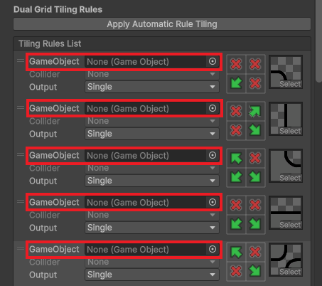
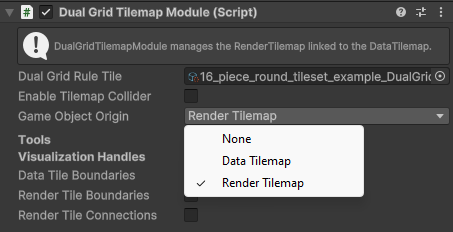

# Dual Grid Tilemap Advanced Features

## Colliders

Unity provides two kind of colliders for Tilemaps:

#### Grid

It transforms each filled cell into a collider, taking the shape of the cell. The Dual Grid Tilemap will place a TilemapCollider2D component in the DataTilemap. 

#### Sprite

It uses the selected Sprite as a collider for each cell. In contrast to the Grid collider type, the Dual Grid Tilemap will place a TIlemapCollider2D component in the RenderTilemap instead. This type is particularly useful if any rounded corner tilesets are used.

To prepare the Dual Grid Tilemap to use colliders, we must first set it up in the respective Dual Grid Rule Tile.

### Dual Grid Rule Tile Configuration

Create or open an existing Dual Grid Rule Tile, and in the 'Rule Tile Settings' header, find the Collider field:

### Dual Grid Tilemap Module Configuration

Then, all that's left is to enable the Tilmap Collider in the Dual Grid Tilemap Module:

## GameObjects

Unity allows GameObjects to be associated in a specific Tile which are instantiated when said Tile is placed on a Tilemap. In a standard Rule Tile, it's even possible to set a different GameObject per Tiling Rule. 

This is quite useful if the Tilemap is used to check for collider triggers (hazardous surfaces or ground checks), game logic or many other use cases.

For Dual Grid Rule Tiles, since it makes use of two Tilemaps, both approaches are possible:
- Data Tilemap: single GameObjects for every filled Data Tile
- Render Tilemap: GameObject per specific Tiling Rule

### Examples

Let's take a GameObject prefab that only has a white circle in its center:

And the following Dual Grid Tilemap layout:

#### Data Tilemap Origin

If we set the GameObject to the Data Tile and the origin in the DataTilemap, we'll get the following result:

Every filled Data Tile will have the GameObject set to its center. Note that __it's not possible to set different GameObjects per tile with the Data Tilemap origin__.

#### Render Tilemap Origin

If we use the Render Tilemap as the origin of the GameObject, this is the result:

Now the Circle GameObject is center for each Render Tile, which visually results in each corner of the Data Tilemap being populated with the GameObject.

As explained previously, using the Render Tilemap Origin, we can set different GameObjects depending on what Render Tile has been selected. 

In this practical example, the Dual Grid Rule Tile has been configured so that only the corner Render Tiles have the GameObject set:

Here's how to set it up:

### Dual Grid Rule Tile Configuration

Create or open an existing Dual Grid Rule Tile, and in the 'Rule Tile Settings' header, find the GameObject field:

This will set the GameObject for when the Data Tilemap Origin is used.

Under the Dual Grid Tiling Rules, find the GameObject field for each one:

### Dual Grid Tilemap Module Configuration

Then, all that's left is to select which Game Object Origin to use in the Dual Grid Tilemap Module:

