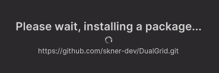

# Installation Guide

This page contains a guide to install using the my dual grid library in Unity from this Git repository.

## Installing

### Unity Asset Store

To install this package, simply go to the Unity Asset Store Page. 

#### 1. Add the Dual Grid Package to Unity Assets

Go to the official [Unity Asset Store Page](https://assetstore.unity.com/packages/2d/skner-s-dual-grid-301999) for Dual Grid.

Click "Add to My Assets"

#### 2. Open Dual Grid in Unity

Click 'Open in Unity', which will automatically launch your Unity Editor and promptly import the package.

Alternatively, find the asset in Unity by navigating into the Package Manager (Window -> Package Manager), under 'My Assets'.

### Git

I recommend installing this package directly through the [Unity Asset Store](#unity-asset-store). However, if you want faster access to new developments, feel free to install it directly from Git.

#### 1. Get the import link from GitHub

Copy this link: https://github.com/skner-dev/DualGrid.git

#### 2. Import from Git in Package Manager

Inside Unity Editor, open the Window -> Package Manager.

In the new Package Manager window, click on the plus button and click on Add -> _Install package from git URL..._

Paste the following URL in the input field: https://github.com/skner-dev/DualGrid.git and click Install.

Wait a moment until the package is installed. Unity will add it to the global packages.

#### 3. Validate installed package

After the process has completed, the package should be visible in the Package Manager:

## Next steps

After the installation has been completed, you can start using it in your project. Check the [user guide](../Documentation~/user-guide.md).
