# User Guide

This article will show you how you can use this library and detail its features.

I recommend learning about how the dual grid works conceptually before attempting to use it. I will be describing examples and also _teaching_ how the system works. If you're interested in quick setup steps, look at the [cheatsheet page](cheatsheet.md).

## Introduction

Before using a dual grid, we need a tilesheet. There are several tilesheet formats but for this dual grid a standard dual grid 16x tileset is necessary. It looks something like this:

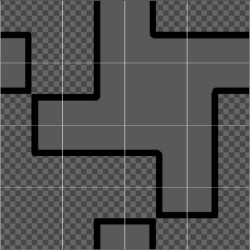

As you can see in the white lines, it's divided in 16 tiles, but not how standard tilesets are divided. 

Each tile represents a unique configuration of corners, which is intended to mimic a half-unit offset of the data grid. 

Consider the following tiles from the above example tilesheet:

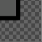 ‎ ‎ ‎ ‎ 
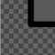 ‎ ‎ ‎ ‎ 
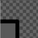 ‎ ‎ ‎ ‎ 
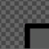 ‎ ‎ ‎ ‎ 

These tiles can be arranged to visually represent the 4 corners of a 1x1 square tile:

 ‎ ‎ ‎ ‎ 

 ‎ ‎ ‎ ‎ 
 ‎ ‎ ‎ ‎ 

If we actually join the tiles with some visual guidelines for the data tile, it will look something like this:

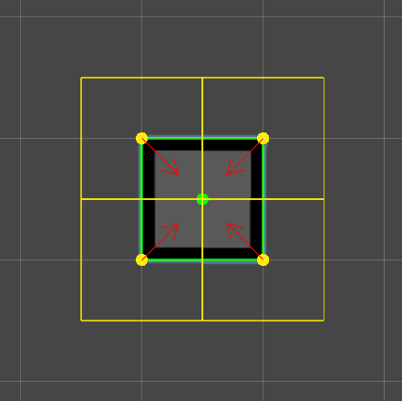

In the above screenshot, we have some visual guidelines: 
- 🟢 The green square that represent a __Data Tile__. 
- 🟡 The 4 yellow squares represent __Render Tiles__.
- 🔴 The red arrows represent the __data neighbours__ for each __Render Tile__.

We paint a single tile in the __Data Tilemap__ and 4 tiles are used to visually represent it in the __Render Tilemap__. By offsetting the __Render Tilemap__ by half a unit, we get this nice overlap, where each Render tile represents the intersection of 4 Data tiles.

With this approach, we can make any shape we want:

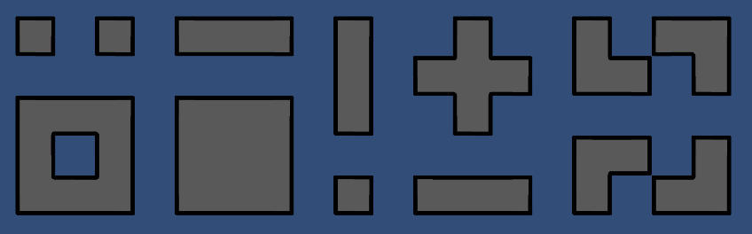

However, Unity doesn't have a built-in way to do this, let alone something that is compatible with their own Tilemap components. This is where this library comes in.

## The Dual Grid Rule Tile

[Rule Tiles](https://docs.unity3d.com/Packages/com.unity.2d.tilemap.extras@4.1/manual/RuleTile.html) in Unity are _smart tiles_. They automatically update depending on their neighbors with rules defined by the user. 

Each Rule Tile contains a list of tiling rules that maps the tile's neighbor configuration to a specific sprite. Then, Unity's internal tilemap code checks for updates in each tilemap and updates any required tile to the correct sprite, defined by these tiling rules:

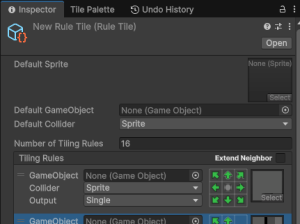

Dual Grid Rule Tiles are very similar, but they are made to work with the dual grid tilemap. 

Instead of each tiling rule defining their neighbors __in the same tilemap__, they consider the neighbor positions from the __Data Tilemap__:

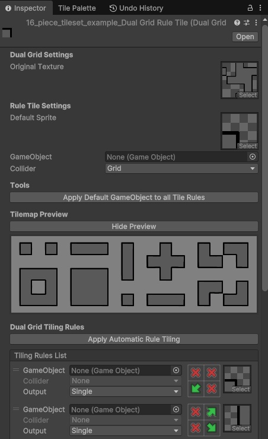

### Importing the tilesheet

With this library, creating this is automatic, even the tiling rules are filled automatically.

For it to work, you'll need a 16x tileset that looks like this:

Import it into Unity and ensure the Sprite Mode is set to _Multiple_.

Then, open the Sprite Editor and perform an _Grid By Cell Count_ slice, in a 4x4 configuration and make sure to have _Keep Empty Rects_ ticked:

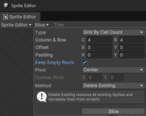

With this, apply the changes and your tilesheet is ready:

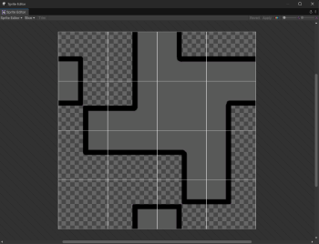 
‎ ‎ ‎ ‎ 
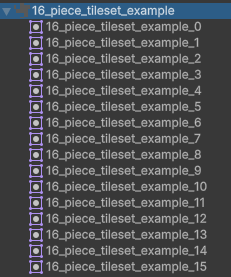

Ensure that the names of each split sprite ends with an '_' followed by a number. Do not change these names, otherwise the automatic tiling process will not work as intended.

### Creating the Dual Grid Rule Tile

This package automatically creates the Dual Grid Rule Tile asset. Simply right-click on the ready tilesheet and click Create -> 2D -> Tiles -> Dual Grid Rule Tile. 

If your tilesheet has been correctly prepared, a dialog box should appear:

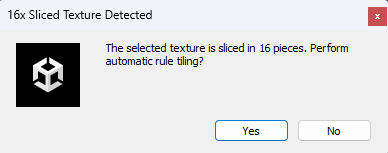

By clicking yes, the system will automatically populate the tiling rules and output the fully functional asset:

Note: If you have any wrong tiling rules it may happen when the slice operation was not performed __exactly__ as described here.

Make use of the built-in preview to ensure your tilemap is properly configured.

## The Dual Grid Tilemap

Now that we have our Dual Grid Rule Tile created, we can start using it.

To use it, we must use a normal tilemap with a custom module that manipulates Unity's tilemap and transforms it into a dual grid tilemap.

You can create one easily by clicking on GameObject -> 2D Object -> Tilemap -> Dual Grid Tilemap.

A new grid should be added to your scene that contains both __Data Tilemap__ and its respective __Render Tilemap__:

In the newly created _DataTilemap_ object, there's the __Dual Grid Tilemap Module__. Assign your newly created __Dual Grid Rule Tile__ to it:

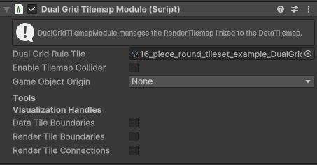

And now you can paint over the __Data Tilemap__ and magic will take care of the rest! You don't need to have a Tile Palette setup for it to work either!

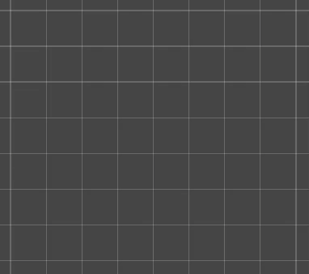

## Next steps

Find documentation on the usage and configuration of more advanced features on the dedicated [Dual Grid Tilemap Advanced Features](dual-grid-tilemap-advanced-features.md) page.

## Multiple tilemaps

You can have multiple tilemaps for more than one grid. As of yet, __there's no support to have different tilesheets per Data Tilemap__, but I might try to implement this in the future.

To do so, you can share a grid, but __never__ share a __Data Tilemap__. 
